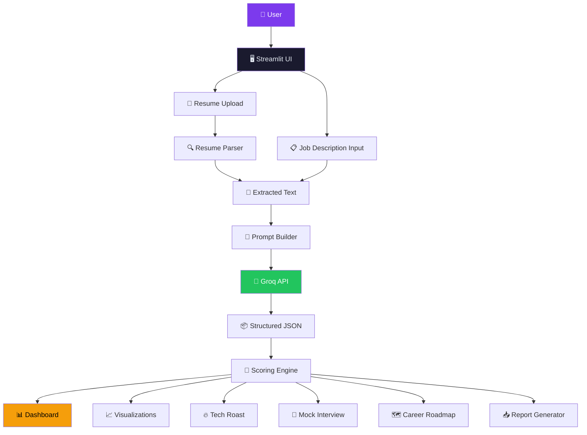
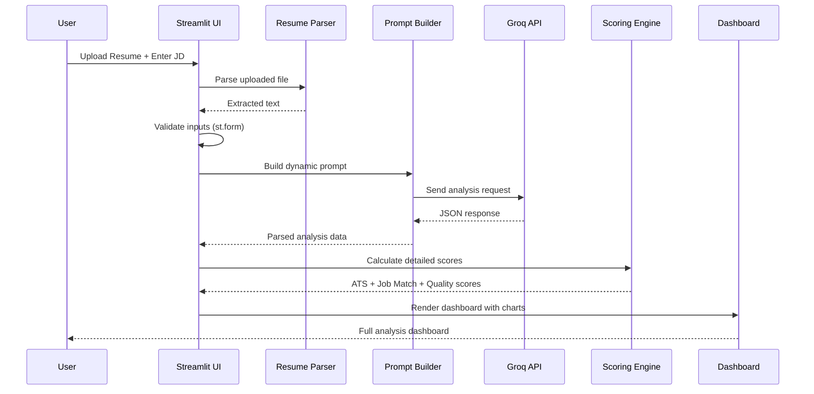

<div align="center">

# 🤖 AI RESUME CRITIC — TECH-ROAST

### *"Your Resume Applied. AI Got Ruthless."*

[](https://python.org)
[](https://streamlit.io)
[](https://groq.com)
[](LICENSE)

**An AI-powered resume analysis platform that ruthlessly evaluates your resume against any target job description using advanced LLM analysis, ATS scoring, and actionable career insights.**

[🔍 Live Demo](#) | [📖 Features](#features) | [🚀 Getting Started](#installation) | [📋 Architecture](#system-architecture)

</div>

---

## 🎯 Overview

**AI Resume Critic** is a production-quality Streamlit application that acts as a ruthless but constructive senior technical recruiter. It analyzes your resume against any job description and provides:

- 📊 ATS Compatibility Score with transparent breakdown
- 🎯 Job Match Score with keyword analysis
- 🔍 Weak Bullet Point Detection & AI Rewriting
- 🧠 Skill Gap Analysis (Technical, Tools, Cloud, Soft Skills)
- 🔥 Tech-Roast Mode (funny but professional)
- 🎤 AI Mock Interview with scoring
- 📊 Career Roadmap (7/30/90-day plan)
- 📥 Downloadable Reports (TXT, HTML, Markdown)

> Built by **Avantika Shukla** as a B.Tech Capstone Project at MirAI School of Technology.

---

## ✨ Features

### 📄 Resume Analysis
- Upload PDF, TXT, or DOCX resumes
- Intelligent text extraction with validation
- Scanned PDF detection and error handling
- Section detection and completeness analysis

### 🎯 ATS Scoring
- Transparent multi-factor scoring engine
- Keyword coverage analysis
- Section completeness evaluation
- Skill coverage assessment
- Score breakdown with progress visualization

### 📊 Job Matching
- Keyword overlap analysis
- Experience relevance scoring
- High-priority skill penalty calculation
- Matching vs Missing keyword comparison

### 🔍 Weak Bullet Rewriting
- Detects vague, passive, or impact-less bullet points
- AI-powered professional rewrites with action verbs
- `[ADD REAL METRIC]` placeholders to prevent fabrication
- One-click copy for improved bullets

### 🔥 Tech-Roast Mode
- Witty, sarcastic but constructive feedback
- Roasts the resume, never the person
- Professional humor suitable for LinkedIn
- Always ends with actionable fixes

### 🧠 Skill Gap Analysis
- Categorized skills: Technical, Tools, Cloud, Soft Skills, Domain
- Priority levels: High, Medium, Low
- Interactive skill gap visualization
- Recommended learning areas

### 🎤 AI Mock Interview
- Multiple modes: Technical, HR, Project, Mixed
- Adjustable difficulty: Easy, Medium, Hard
- Question-by-question scoring
- Progress tracking and feedback
- Interview scorecard with overall assessment

### 📊 Career Insights
- Personalized 7/30/90-day career roadmap
- Skill acquisition plan with resources
- Certification recommendations
- Networking suggestions
- Analysis history with trend charts

### ✅ Improvement Tracker
- Editable checklist (`st.data_editor`) built from weak bullets, missing skills, and priority actions
- Update each item's Status (Not Started / In Progress / Done)
- Edits persist in `st.session_state` for the session — never triggers a new AI call

### 📥 Report Generation
- Download TXT, HTML, or Markdown reports
- Comprehensive analysis summary
- Professional formatting
- All scores, keywords, rewrites, and recommendations

---

## 🛠️ Tech Stack

| Component | Technology |
|-----------|-----------|
| **Framework** | Streamlit 1.40+ |
| **AI Engine** | Groq API (Llama 3.1 70B) |
| **Data Processing** | Pandas, NumPy |
| **Visualization** | Plotly |
| **PDF Parsing** | PyPDF |
| **DOCX Parsing** | python-docx |
| **Environment** | python-dotenv |
| **Language** | Python 3.12+ |

---

## 📦 Installation

### Prerequisites
- Python 3.12 or higher
- A [Groq API Key](https://console.groq.com)

### Steps

```bash
# 1. Clone the repository
git clone https://github.com/avantika-shukla/ai-resume-critic.git
cd ai-resume-critic

# 2. Create a virtual environment
python -m venv venv
source venv/bin/activate  # Linux/Mac
# OR
venv\Scripts\activate     # Windows

# 3. Install dependencies
pip install -r requirements.txt

# 4. Set up environment variables
cp .env.example .env
# Edit .env and add your GROQ_API_KEY

# 5. Run the application
streamlit run app.py
```

---

## 🔑 Environment Variables

Create a `.env` file in the project root:

```env
GROQ_API_KEY=your_groq_api_key_here
```

### For Streamlit Cloud Deployment

1. Go to your app settings on [Streamlit Community Cloud](https://streamlit.io/cloud)
2. Navigate to **Secrets** section
3. Add:
   ```
   GROQ_API_KEY = your_groq_api_key_here
   ```

---

## 🏗️ System Architecture



### Module Breakdown

| Module | Purpose |
|--------|---------|
| `app.py` | Main entry point, routing, UI rendering |
| `utils/groq_client.py` | Groq API integration, JSON parsing |
| `utils/resume_parser.py` | PDF/TXT/DOCX text extraction |
| `utils/jd_parser.py` | Job description validation |
| `utils/prompts.py` | All AI prompt templates |
| `utils/scoring.py` | ATS, Job Match, Resume Quality scoring |
| `utils/session_manager.py` | Streamlit session state management |
| `utils/report_generator.py` | TXT/HTML/Markdown report generation |
| `pages/*.py` | Multi-page navigation support |
| `data/sample_resume.txt` | Demo resume for testing |

---

## 📊 Data Flow



1. **User Upload** → User uploads resume (PDF/TXT/DOCX) and enters job description
2. **Parsing** → Resume parser extracts clean text from the uploaded file
3. **Validation** → Both resume and JD are validated for completeness
4. **Prompt Building** → Dynamic prompt is constructed with resume text + JD + context
5. **AI Analysis** → Groq API analyzes the resume and returns structured JSON
6. **JSON Validation** → Response is parsed, validated, and error-handled
7. **Scoring** → Multi-factor scoring engine calculates ATS, Job Match, and Quality scores
8. **Visualization** → Plotly charts, Pandas tables, and KPI cards render the dashboard
9. **Session State** → All results are preserved in Streamlit session_state
10. **Reporting** → User can download comprehensive reports in multiple formats

---

## 📁 Project Structure

```
ai-resume-critic/
│
├── app.py                          # Main application entry point
├── requirements.txt                # Python dependencies
├── README.md                       # This file
├── .env.example                    # Environment variable template
├── .gitignore                      # Git ignore rules
│
├── .streamlit/
│   └── config.toml                # Streamlit configuration (dark theme)
│
├── pages/                          # Multi-page navigation
│   ├── __init__.py
│   ├── 01_Resume_Analysis.py
│   ├── 02_Job_Match.py
│   ├── 03_Interview.py
│   ├── 04_Career_Insights.py
│   └── 05_Report.py
│
├── utils/                          # Core utility modules
│   ├── __init__.py
│   ├── groq_client.py             # Groq API client & JSON parser
│   ├── resume_parser.py           # PDF/TXT/DOCX text extraction
│   ├── jd_parser.py               # Job description validation
│   ├── prompts.py                 # All AI prompt templates
│   ├── scoring.py                 # Scoring engine
│   ├── session_manager.py         # Session state management
│   └── report_generator.py       # Report generation
│
├── data/
│   └── sample_resume.txt          # Demo resume
│
└── assets/
    └── (placeholder for logo)
```

---

## 🧠 AI Prompt Architecture

The system uses **specialized prompts** for each feature:

| Prompt | Purpose | Model |
|--------|---------|-------|
| `RESUME_ANALYSIS_PROMPT` | Full resume analysis with structured JSON output | llama-3.3-70b-versatile |
| `TECH_ROAST_PROMPT` | Witty roast of resume with constructive fixes | llama-3.3-70b-versatile |
| `BULLET_REWRITE_PROMPT` | Professional bullet point rewrites | llama-3.3-70b-versatile |
| `INTERVIEW_PROMPT` | Generate contextual interview questions | llama-3.3-70b-versatile |
| `CAREER_ROADMAP_PROMPT` | Personalized career improvement plan | llama-3.3-70b-versatile |

All prompts use **dynamic f-string context injection** — the AI always evaluates the resume against the specific target role and job description provided by the user.

---

## 🔒 Security

- **No hardcoded API keys** — Uses environment variables and Streamlit secrets
- **No persistent storage** — Resume data is processed in-memory only
- **No internal prompt exposure** — System prompts are never shown to users
- **Privacy-first** — Uploaded content is not logged or stored
- **Error sanitization** — No stack traces or internal details exposed to users

---

## 🚀 Deployment on Streamlit Cloud

1. Push your code to a GitHub repository
2. Go to [Streamlit Community Cloud](https://streamlit.io/cloud)
3. Click **New App** → Connect your GitHub repo
4. Set the main file to `app.py`
5. Add your `GROQ_API_KEY` in the **Secrets** section
6. Deploy!

### Deployment Checklist
- [x] `requirements.txt` with pinned versions
- [x] `.streamlit/config.toml` for theme
- [x] No hardcoded local paths
- [x] No system-only dependencies
- [x] Environment variables via secrets
- [x] README with setup instructions

---

## 🧪 Testing

The application handles the following test scenarios:

| Scenario | Expected Behavior |
|----------|-------------------|
| Fresh launch | Shows home page with demo button |
| Demo mode | Loads sample resume + JD |
| Resume upload (PDF) | Extracts text, validates |
| Resume upload (TXT) | Extracts text, validates |
| Resume upload (DOCX) | Extracts text, validates |
| Empty resume | Shows validation warnings |
| Empty JD | Shows validation warnings |
| Valid analysis | Full dashboard with charts |
| Invalid Groq response | Graceful error handling |
| API failure | User-friendly error message |
| Missing API key | Warning with setup instructions |
| Session state persistence | Data survives reruns |
| Reset button | Clears session safely |
| Multiple analyses | History tracked, deltas shown |
| Download report | TXT/HTML/Markdown downloads |
| Interview flow | Questions, scoring, completion |

---

## 🎯 Capstone Rubric Alignment

| Criteria | Target Score | Implementation |
|----------|-------------|----------------|
| **Technical Implementation (25)** | 25/25 | Python, st.session_state, st.form, Pandas, modular architecture, error handling |
| **AI Integration (20)** | 20/20 | Groq API, system prompts, dynamic context, structured output, specialized behavior |
| **UI / Visualization (20)** | 20/20 | Professional dashboard, st.metric with KPI deltas, st.data_editor tracker, Plotly charts, Pandas tables |
| **Deployment (15)** | 15/15 | Streamlit Cloud ready, requirements.txt, config.toml |
| **GitHub (10)** | 10/10 | Custom README, architecture diagrams, setup instructions |
| **System Design (10)** | 10/10 | Mermaid diagrams, data flow, API integration docs |
| **Total** | **100/100** | |

---

## 📄 License

This project is licensed under the MIT License.

---

## 👩‍💻 Author

**Avantika Shukla**
B.Tech Computer Science | MirAI School of Technology

[](https://github.com/avantika-shukla)
[](https://linkedin.com/in/avantika-shukla)

---

<div align="center">

**Built with ❤️ by Avantika Shukla**

*AI Resume Critic — "Your Resume Applied. AI Got Ruthless."*

</div>
